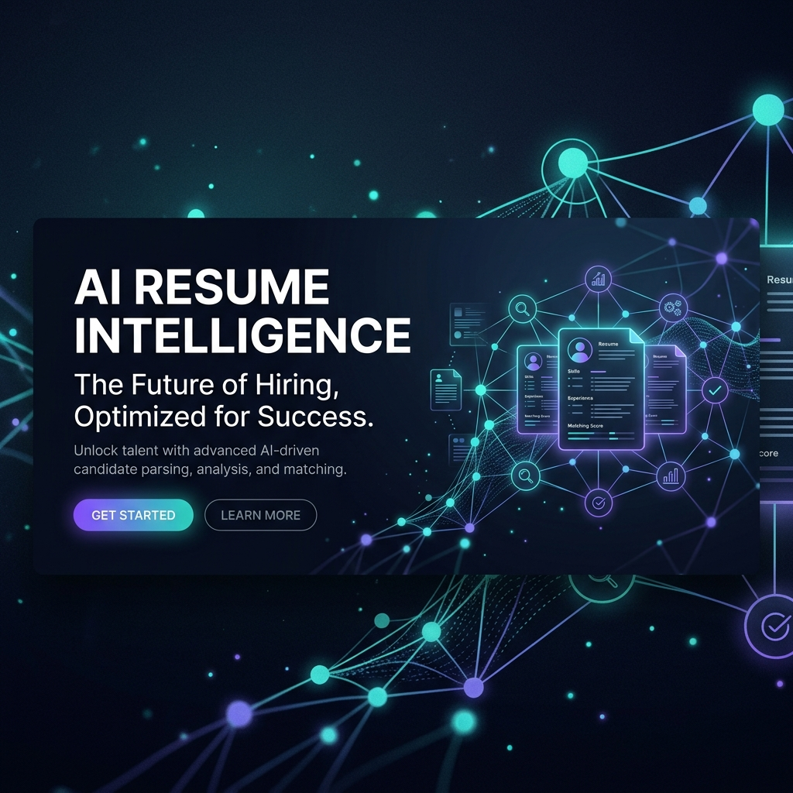
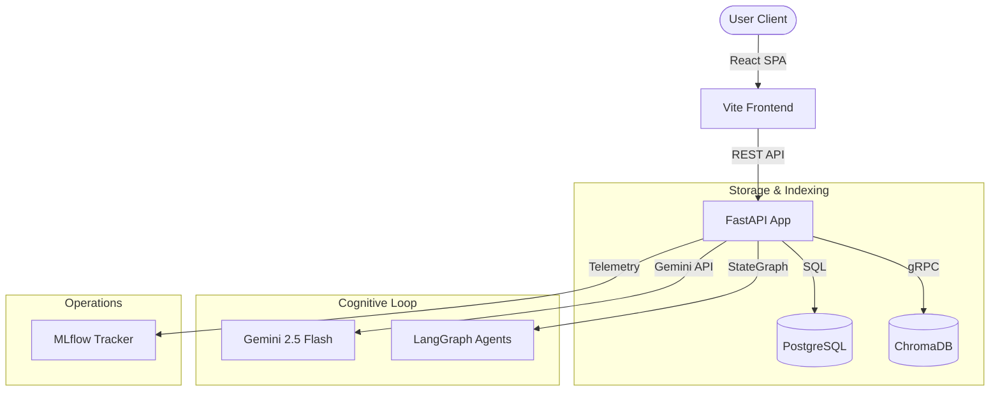

# AI-Powered Resume Intelligence Platform



An enterprise-grade, multi-agent AI resume parsing, ATS scoring, semantic job description matching, and RAG Q&A chat platform. Empowered by Google Gemini, LangGraph, and ChromaDB.

---

## Overview

The **AI-Powered Resume Intelligence Platform** is a state-of-the-art developer and recruitment toolkit designed to automate resume analysis and candidate-job matching. By combining traditional heuristic parsing with advanced LLM agents and semantic vector databases, the platform delivers high-fidelity compliance scoring, resume rewriting suggestions, and context-aware candidate Q&A.

## Problem Statement

Traditional Applicant Tracking Systems (ATS) rely on rigid keyword matching, frequently rejecting highly qualified candidates due to minor formatting discrepancies or differences in terminology. At the same time, recruiters spend hours manual reading resumes to assess fit against a job description. 

This platform bridges the gap by:
1. **Intelligent Parsing**: Bypassing format limitations to extract sections, skills, and histories accurately.
2. **Semantic Matching**: Utilizing dense vector representations to match resumes against job descriptions based on conceptual alignment rather than exact keywords.
3. **Multi-Agent Evaluation**: Orchestrating a team of dedicated AI agents (ATS Expert, Recruiter, Reviewer, and Advisor) to conduct a holistic, multi-perspective evaluation.
4. **Contextual Chat (RAG)**: Allowing recruiters to "talk to the resume" in real-time, asking specific questions about experience, education, or achievements.

---

## Architecture



For a comprehensive breakdown of sequence charts, data flows, and sub-systems, refer to the [System Architecture Documentation](docs/architecture.md).

---

## Key Features

1. **Resume Parser**: Direct PDF & DOCX text extraction using spaCy NER models and structured regex heuristics.
2. **ATS Checker**: Weighted evaluation scoring based on keyword match density (40%), section completeness (40%), and length constraints (20%).
3. **Semantic JD Matcher**: Dense vector embedding comparisons utilizing `sentence-transformers` for conceptual alignment matching.
4. **Resume Rewriter**: Generates tailored bullet points and full resume rewrites target-matched to job descriptions.
5. **Interview Generator**: Evaluates candidates to generate targeted interview questions based on missing skills and experience.
6. **Skill Gap Analyzer**: Automatically extracts missing technologies and lists actionable learning goals.
7. **Career Roadmap**: LangGraph Career Advisor agent suggests target certifications, growth paths, and roles.
8. **RAG Chatbot**: Interactive chatbot using LangChain ChromaDB retriever and Gemini models for contextual Q&A.
9. **Multi-Agent Workflow**: Sequential execution of ATS Expert, Recruiter, Reviewer, and Advisor agents in a LangGraph StateGraph, compiling a consolidated report.
10. **Recruiter Simulator**: Evaluates candidate hiring verdicts (`Shortlist` / `Consider` / `Reject`) with explicit rationales.
11. **Analytics Dashboard**: Dynamic Recharts dashboard charting historical ATS trendlines, matching percentages, missing skill frequencies, and multi-agent ratings.
12. **Dockerization**: Single-command startup utilizing docker-compose for multi-service environments.
13. **MLflow Telemetry**: Logs parameters, scores, RAG queries, and agent outputs to an MLflow tracking server for monitoring.

---

## Tech Stack

### Backend
- **Framework**: FastAPI (Asynchronous API gateway)
- **Database**: PostgreSQL (Structured persistent models)
- **Vector Database**: ChromaDB (High-dimensional vector indexing)
- **Agent Orchestrator**: LangGraph (Directed state graph loops)
- **LLM Integrations**: Google Generative AI (Gemini 2.5 Flash, Google Embeddings)
- **Local ML/NLP**: Sentence-Transformers (`all-MiniLM-L6-v2`), spaCy (`en_core_web_sm`)
- **Telemetry**: MLflow (Run tracking and parameters logging)

### Frontend
- **Framework**: React 18, TypeScript, Vite
- **Styling**: TailwindCSS
- **Visualizations**: Recharts (Interactive SVG charting engine)

---

## Folder Structure

```
d:\ATS checker\
├── backend/                    # FastAPI python code
│   ├── app/
│   │   ├── api/v1/endpoints/   # Router endpoints
│   │   ├── core/               # App configuration, security, DB connection
│   │   ├── models/             # SQLAlchemy schemas
│   │   ├── schemas/            # Pydantic models
│   │   └── services/           # Business logic & AI pipelines
│   │       ├── mlflow_service.py # MLflow tracking handlers
│   │       └── agent_workflow.py # LangGraph agent structures
│   ├── alembic/                # DB migration versions
│   └── tests/                  # Pytest test suite
├── frontend/                   # React frontend application
│   ├── src/
│   │   ├── pages/              # Landing page & Dashboard
│   │   ├── services/           # Backend API connector
│   │   └── components/ui/      # Custom styled components
│   └── vercel.json             # Vercel SPA routing
├── docker/                     # Dockerfiles & scripts
│   ├── backend/                # Dockerfile and startup scripts
│   └── frontend/               # Dockerfile and Nginx setup
├── docs/                       # Specifications, reports & architectures
│   └── images/                 # Banner assets
├── docker-compose.yml          # Container configuration orchestrator
└── railway.json                # Railway backend deploy recipe
```

---

## Installation & Setup

### Prerequisites
- Python 3.12+
- Node.js 18+
- Docker & Docker Compose
- PostgreSQL (Local or Cloud instance)

### 1. Environment Configuration
Copy the environment template and configure your local variables:
```bash
copy .env.example .env
```
Fill in your `GEMINI_API_KEY`, `POSTGRES_PASSWORD`, and generate a secure `SECRET_KEY`:
```bash
python -c "import secrets; print(secrets.token_hex(32))"
```

### 2. Local Setup (Without Docker)

#### Backend:
```bash
cd backend
python -m venv .venv
.venv\Scripts\activate
pip install -r requirements.txt
python -m spacy download en_core_web_sm
alembic upgrade head
uvicorn app.main:app --reload --host 0.0.0.0 --port 8080
```

#### Frontend:
```bash
cd ../frontend
npm install
npm run dev
```

### 3. Containerized Setup (Docker Compose)
To start all services (Backend, Frontend, PostgreSQL, ChromaDB) with a single command:
```bash
docker compose up --build
```
Ensure your `.env` contains your active `GEMINI_API_KEY` before starting.

---

## API Documentation

FastAPI automatically generates interactive documentation. Once the backend is running, visit:
- **Swagger UI**: http://localhost:8080/docs
- **ReDoc**: http://localhost:8080/redoc

### Endpoint Index

| Method | Endpoint | Description |
|---|---|---|
| POST | `/api/v1/resume/upload` | Upload PDF/DOCX and trigger parsing |
| POST | `/api/v1/ats/score` | Compute parsing and compliance scores |
| POST | `/api/v1/jd-matcher/match` | Measure semantic similarity against a Job Description |
| POST | `/api/v1/llm/improve` | Generate bullet point improvements via Gemini |
| POST | `/api/v1/llm/rewrite` | Generate full resume rewrites target-matched to JD |
| POST | `/api/v1/llm/interview-questions` | Generate interview questions matching skill gaps |
| POST | `/api/v1/llm/cover-letter` | Generate customized cover letters |
| POST | `/api/v1/rag/ingest` | Chunk and index resume to ChromaDB |
| POST | `/api/v1/rag/chat` | Chat semantically with the resume |
| POST | `/api/v1/agents/analyze` | Execute LangGraph agent workflow evaluations |
| GET | `/api/v1/analytics/dashboard` | Fetch dashboard charts metrics |

---

## RAG & Multi-Agent Pipelines

### RAG Pipeline
When a resume is ingested, it is segmented using LangChain's `RecursiveCharacterTextSplitter` into 400-character chunks with a 40-character overlap. Chunks are embedded via Google's `models/embedding-001` and saved in ChromaDB under a metadata filter matching `resume_id`. Chat queries fetch the top 3 semantically relevant chunks to build a prompt injected into `gemini-2.5-flash`.

### Multi-Agent StateGraph
Using LangGraph, the agent system manages state transformations across 5 nodes:
- **ATS Expert**: Evaluates formatting compliance and structural compatibility.
- **Recruiter**: Reviews skills against target parameters to issue hiring decisions.
- **Resume Reviewer**: Audits writing quality, action verbs, and readability.
- **Career Advisor**: Extrapolates growth opportunities, certifications, and paths.
- **Consolidation Agent**: Compiles feedbacks into a unified JSON report with strengths, fixes, and a fit percentage.

---

## Database Schema

```
┌─────────────────┐       ┌─────────────────┐       ┌───────────────────┐
│      users      │       │     resumes     │       │  resume_versions  │
├─────────────────┤       ├─────────────────┤       ├───────────────────┤
│ id (PK, UUID)   │1 ─── *│ id (PK, UUID)   │1 ─── *│ id (PK, UUID)     │
│ email (Unique)  │       │ user_id (FK)    │       │ resume_id (FK)    │
│ hashed_password │       │ title           │       │ version_number    │
│ is_active       │       └─────────────────┘       │ file_name         │
└─────────────────┘                                 │ file_path         │
         │ 1                                        │ raw_text          │
         ├──────────────────────────┐               │ structured_data   │
         │ 1                        │ 1             └───────────────────┘
┌─────────────────┐        ┌─────────────────┐                │ 1
│  chat_sessions  │        │  agent_reports  │                ├─────────────────┐
├─────────────────┤        ├─────────────────┤                │ *               │ *
│ id (PK, UUID)   │        │ id (PK, UUID)   │        ┌───────────────┐ ┌───────────────┐
│ user_id (FK)    │        │ user_id (FK)    │        │  ats_reports  │ │ match_reports │
│ resume_id (FK)  │        │ report_type     │        ├───────────────┤ ├───────────────┤
│ title           │        │ content (JSON)  │        │ id (PK, UUID) │ │ id (PK, UUID) │
│ history (JSON)  │        └─────────────────┘        │ version_id(FK)│ │ version_id(FK)│
└─────────────────┘                                   │ score (Float) │ │ score (Float) │
                                                      │ findings(JSON)│ │ skills (JSON) │
                                                      └───────────────┘ └───────────────┘
```

For table-by-table column types and schemas, see [Database Schema Specifications](docs/database_schema.md).

---

## Production Deployment

### Backend (Railway)
1. Link your GitHub repo to a new Railway Service.
2. Select Dockerfile builder path: `docker/backend/Dockerfile`.
3. Add environmental variables as specified in [Configuration Reference](configuration_reference.txt).
4. Auto-migrations will execute on boot.

### Frontend (Vercel)
1. Add a new Vercel Project and select your repository.
2. Configure **Root Directory** as `frontend` and select **Vite** preset.
3. Configure environmental variable: `VITE_API_URL` pointing to your Railway backend URL.

For complete, detailed instructions on databases, services, and troubleshooting, see the [Production Deployment Guide](docs/deployment.md).

---

## Security Considerations
- **CORS Lockdowns**: Restrict `allow_origins` in `backend/app/main.py` to your client domain in production.
- **Secret Encryption**: Ensure `SECRET_KEY` is a secure, random hex string.
- **Secrets Scanning**: Never commit credentials to version control. Keep `.env` and SQLite files gitignored.
- For complete security audit documentation, refer to the [Security Audit Report](docs/security_audit.md).

---

## Future Enhancements
- **Multi-Tenant Authentication**: Add JWT authentication with password reset and token blacklists.
- **Mock-Free Local Testing**: Support offline local embeddings and mock-free testing configurations.
- **Deep Resume Parsing**: Integrate layout-aware PDF parsers (like OCR/LayoutLM) to extract tabular structures.

---

## License
Distributed under the MIT License. See [LICENSE](LICENSE) for more details.