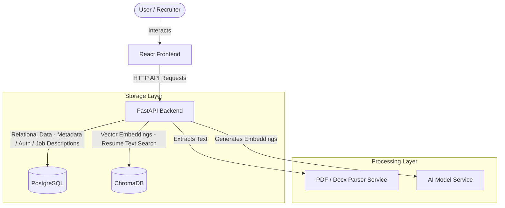

# System Architecture - AI Resume Intelligence Platform

This document outlines the architectural boundaries and high-level components of the AI Resume Intelligence Platform.

## System Components

### Component Details

1. **Frontend (React, TS, Vite, Tailwind CSS, ShadCN)**:
   - Dynamic Single Page Application (SPA) offering interfaces for resume uploads, search queries, matching score views, and metadata dashboards.

2. **Backend (FastAPI, Python 3.12)**:
   - Orchestrates request lifecycles, database connections (PostgreSQL/ChromaDB), and runs asynchronous jobs for document parsing and scoring.

3. **Relational DB (PostgreSQL)**:
   - Stores candidate metadata, file upload records, job postings, matching logs, user auth accounts, and historical ATS results.

4. **Vector DB (ChromaDB)**:
   - Manages persistence and search indexes for candidate embeddings. Supports nearest-neighbor query comparisons for semantic searches.
