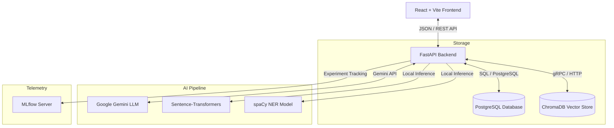
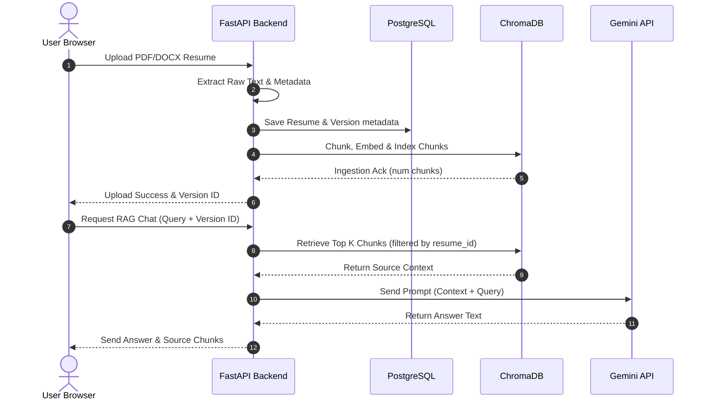
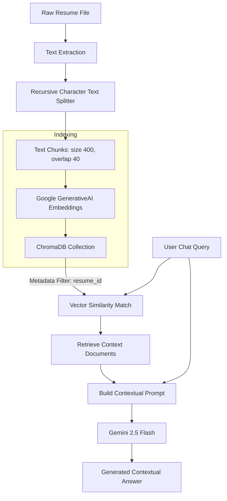
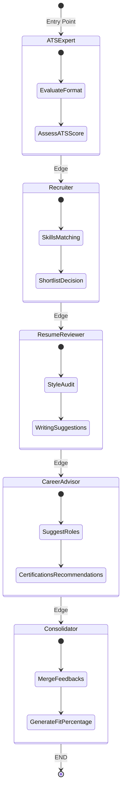
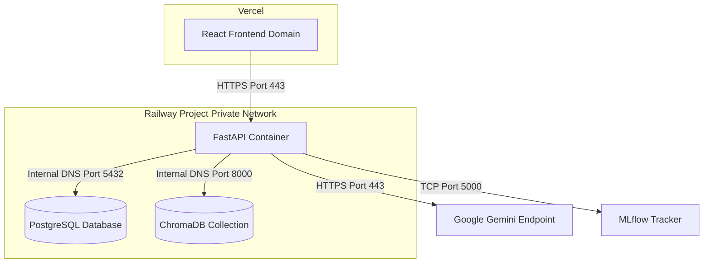

# System Architecture & Technical Specification

This document provides a deep dive into the system design, data flows, and architectural layers of the AI-Powered Resume Intelligence Platform.

---

## High-Level Architecture Diagram

---

## Architectural Layers

### 1. Frontend Client
- **Core Stack**: React 18, TypeScript, TailwindCSS.
- **Routing**: Single Page Application (SPA) routing via `react-router-dom`.
- **Charts**: Recharts (`AreaChart`, `BarChart`, `RadarChart`) for analytics visualization.
- **API Client**: Axios-based client utilizing environmental base URLs and local mocks fallback.

### 2. FastAPI Backend Application
- **Routing**: Modular FastAPI routing grouped by feature domains (`/resume`, `/ats`, `/jd-matcher`, `/llm`, `/rag`, `/agents`, `/analytics`).
- **Database Engine**: SQLAlchemy ORM with connection pooling, transactional management, and Alembic schema versioning.
- **AI Service Orchestration**: Encapsulates document extraction, semantic indexing, LangGraph workflows, and Gemini LLM prompts in decoupled service modules.

### 3. Storage Layer
- **Relational Data**: PostgreSQL stores persistent structural schemas (users, resumes, versions, reports, chat sessions).
- **Vector Data**: ChromaDB index stores high-dimensional dense vector embeddings of resume segments for semantically filtered contextual queries.

### 4. LLM & Inference Layer
- **Generation Model**: `gemini-2.5-flash` for multi-agent reasoning, resume rewrite generation, interview Q&A, and cover letters.
- **Embedding Model**: `models/embedding-001` for RAG document chunking vector generation.
- **Local Embeddings**: `all-MiniLM-L6-v2` via `sentence-transformers` for calculating cosine similarities without external API delays.
- **Local NER**: `en_core_web_sm` via `spaCy` for high-throughput heuristic metadata extraction.

---

## Data Flow Diagram

---

## RAG Pipeline Flow

---

## LangGraph Multi-Agent Workflow

The agentic pipeline is organized as a sequential directed graph (`StateGraph`) where independent agents evaluate candidate details and transition to the next evaluator, culminating in a centralized consolidated report.

---

## Containerized Production Deployment Diagram

