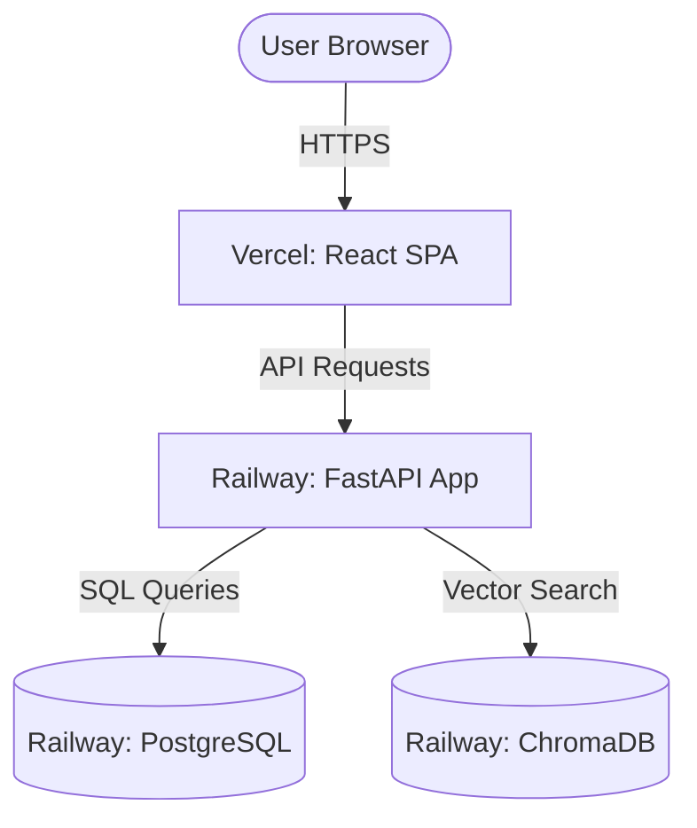

# Production Deployment Guide

This guide provides step-by-step instructions to deploy the AI-Powered Resume Intelligence Platform to production.

## Deployment Overview


---

## Part 1: Provisioning the PostgreSQL Database

You can use Railway's built-in PostgreSQL database service or an external provider like Neon or Supabase.

### Options
1. **Railway PostgreSQL (Recommended)**:
   - In your Railway project, click **New** ➔ **Database** ➔ **Add PostgreSQL**.
   - Railway will automatically provision a database and inject the private database URL inside your project.
2. **External (Neon / Supabase)**:
   - Create a database on [Neon](https://neon.tech/) or [Supabase](https://supabase.com).
   - Copy the PostgreSQL connection string (`postgresql://...`).

---

## Part 2: Deploying ChromaDB on Railway

ChromaDB is required for the RAG (Resume Chat) functionality.

1. In your Railway project, click **New** ➔ **Deploy from Docker Image**.
2. Search and select: `chromadb/chroma:latest`.
3. Go to the service **Variables** tab and add:
   - `IS_PERSISTENT`: `TRUE`
   - `PERSIST_DIRECTORY`: `/chroma/chroma`
   - `PORT`: `8000`
4. Go to the service **Settings** tab and configure a custom/public TCP domain or reference the internal DNS domain:
   - Internal URL: `http://chromadb.railway.internal:8000` (or the specific service name generated by Railway, e.g., `http://chromadb:8000`).

---

## Part 3: Deploying Backend (FastAPI) on Railway

The backend runs as a containerized Python FastAPI service.

1. Click **New** ➔ **GitHub Repo** ➔ select your repository.
2. Go to the service **Settings** tab:
   - Set the service name to `backend`.
   - Railway will automatically read `railway.json` at the root and use `docker/backend/Dockerfile` to build the app.
3. Go to the **Variables** tab and add the following production variables:

| Variable | Value / Description | Source |
|---|---|---|
| `DATABASE_URL` | `${{Postgres.DATABASE_URL}}` (or external postgres link) | Provided by DB |
| `GEMINI_API_KEY` | *Your Gemini API Key (e.g., AIzaSy...)* | Gemini API |
| `SECRET_KEY` | *Generate a secure random hex string* (64 chars) | `python -c "import secrets; print(secrets.token_hex(32))"` |
| `ACCESS_TOKEN_EXPIRE_MINUTES` | `11520` (8 days) | Configuration |
| `CHROMA_HOST` | `chromadb.railway.internal` (or service reference) | Chroma Service |
| `CHROMA_PORT` | `8000` | Chroma Service |
| `API_V1_STR` | `/api/v1` | Backend Path |

4. Railway will automatically expose the backend on a dynamic port using the `$PORT` environment variable. 
5. Under service **Settings**, click **Generate Domain** to get a public URL for your backend (e.g., `https://backend-production-xxxx.up.railway.app`).

---

## Part 4: Deploying Frontend (React + Vite) on Vercel

The frontend is a static React application deployed to Vercel.

1. Log in to [Vercel](https://vercel.com) and click **Add New** ➔ **Project**.
2. Connect your GitHub repository.
3. Configure the project settings:
   - **Root Directory**: `frontend`
   - **Framework Preset**: `Vite`
   - **Build Command**: `npm run build`
   - **Output Directory**: `dist`
4. Add the following **Environment Variable**:
   - `VITE_API_URL`: `https://backend-production-xxxx.up.railway.app/api/v1` (replace with your public Railway backend URL).
5. Click **Deploy**. Vercel will build the frontend and serve it with automatic HTTPS.

---

## Part 5: Production Security & CORS

To secure your production API and prevent unauthorized domain access, restrict CORS to your Vercel frontend domain:

1. Open [backend/app/main.py](file:///d:/ATS%20checker/backend/app/main.py) line 17:
   - Change `allow_origins=["*"]` to your production frontend URL:
   - `allow_origins=["https://your-frontend.vercel.app"]`
2. Update the environment variables and re-deploy.

---

## Troubleshooting & Verification

### Automated Migrations
On startup, the backend container automatically runs the Alembic migration script using:
```bash
alembic upgrade head
```
This is configured inside [entrypoint.sh](file:///d:/ATS%20checker/docker/backend/entrypoint.sh), which checks database readiness before executing migrations.

### Health Check Endpoint
Verify your backend is alive and database connectivity is healthy:
- URL: `https://backend-production-xxxx.up.railway.app/api/v1/health` (if implemented, or `docs` OpenAPI UI).
